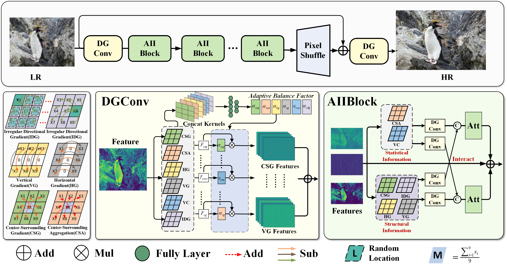

# Efficient Real-world Image Super-Resolution Via Adaptive Directional Gradient Convolution

[]([https://arxiv.org/abs/2408.11758](https://arxiv.org/abs/2405.07023))  []() 

## :bookmark: News!!!
- [x] 2024-05-07: **Arxiv Version has been released.**
- [ ] The code will be released soon.


## Abstract

Real-SR endeavors to produce high-resolution images with rich details while mitigating the impact of multiple degradation factors. Although existing methods have achieved impressive achievements in detail recovery, they still fall short when addressing regions with complex gradient arrangements due to the intensity-based linear weighting feature extraction manner. Moreover, the stochastic artifacts introduced by degradation cues during the imaging process in real LR increase the disorder of the overall image details, further complicating the perception of intrinsic gradient arrangement. To address these challenges, we innovatively introduce kernel-wise differential operations within the convolutional kernel and develop several learnable directional gradient convolutions. These convolutions are integrated in parallel with a novel linear weighting mechanism to form an Adaptive Directional Gradient Convolution (DGConv), which adaptively weights and fuses the basic directional gradients to improve the gradient arrangement perception capability for both regular and irregular textures. Coupled with DGConv, we further devise a novel equivalent parameter fusion method for DGConv that maintains its rich representational capabilities while keeping computational costs consistent with a single Vanilla Convolution (VConv), enabling DGConv to improve the performance of existing super-resolution networks without incurring additional computational expenses. To better leverage the superiority of DGConv, we further develop an Adaptive Information Interaction Block (AIIBlock) to adeptly balance the enhancement of texture and contrast while meticulously investigating the interdependencies, culminating in the creation of a DGPNet for Real-SR through simple stacking. Comparative results with 15 SOTA methods across three public datasets underscore the effectiveness and efficiency of our proposed approach.

## Framework



## :sparkles: Getting Start

### Prepare environment


## Cite US
Please cite us if this work is helpful to you.

```
@article{peng2024efficient,
  title={Efficient Real-world Image Super-Resolution Via Adaptive Directional Gradient Convolution},
  author={Peng, Long and Cao, Yang and Pei, Renjing and Li, Wenbo and Guo, Jiaming and Fu, Xueyang and Wang, Yang and Zha, Zheng-Jun},
  journal={arXiv preprint arXiv:2405.07023},
  year={2024}
}
```

## Acknowledgments
The basic code is partially from the below repos.
- [BasicSR]([link](https://github.com/XPixelGroup/BasicSR))
